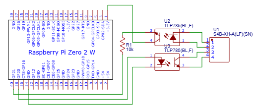
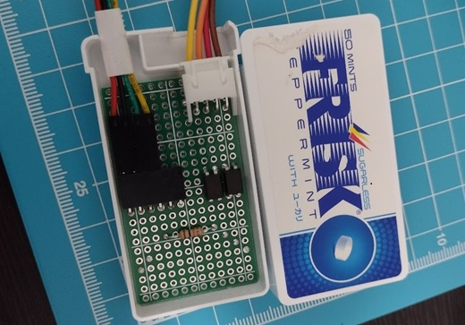

# JEMA2MQTT

[](LICENSE)


## 概要

JEM1427(HA端子、JEM-A端子)をGPIOに接続し、MQTT、Home Assistantで操作するためのアプリケーションです。

Raspberry Pi Zero(またはZero2)に下記の回路を取り付けることで動作します。

## 回路図



## 必要な部品

- [XHコネクタ ベース付ポスト サイド型 4P](https://akizukidenshi.com/catalog/g/g112842/) x1
- [フォトカプラ TLP785(BLランク)](https://akizukidenshi.com/catalog/g/g109846/) x2
- [カーボン抵抗(炭素皮膜抵抗) 1/4W10kΩ](https://akizukidenshi.com/catalog/g/g125103/) x1
- [L型ピンソケット 1x6](https://akizukidenshi.com/catalog/g/g109862/) x1
- [ユニバーサル基板](https://akizukidenshi.com/catalog/g/g112188/) x1

## 実装サンプル



## 使い方

### 設定ファイルの作成

`config.json` に機器情報を設定

```json
{
  "deviceId": "string",
  "entities": [
    {
      "id": "string",
      "name": "name",
      "domain": "lock",
      "controlGpio": 98,
      "monitorGpio": 99
    }
  ]
}
```

### インストールと起動

```sh
npm install
npm run build
node --env-file=.env index.mjs
```

> [!TIP]  
> 必要な環境変数については[こちら](src/env.ts)をご確認ください。
>
> ビルド済みの[`index.mjs`](https://github.com/nana4rider/jema2mqtt/releases/)、[`config.json`](./config.json.example)、[`.env`](./.env.example)のみで動作しますので、Raspberry Piに配置してください。
>
> Node.jsのインストール、サービス登録のためのスクリプトを[こちら](./installer)に用意しています。
